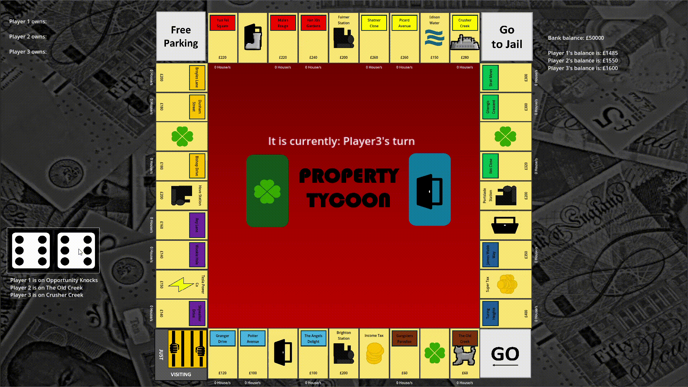
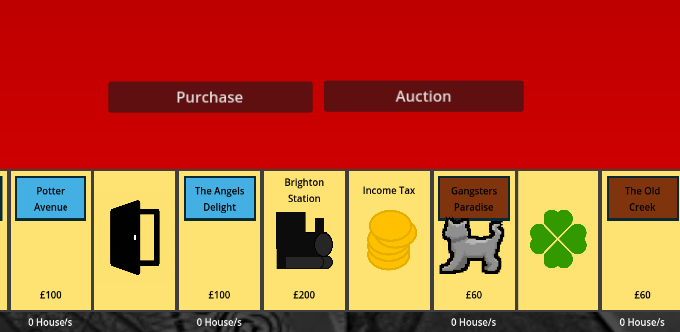
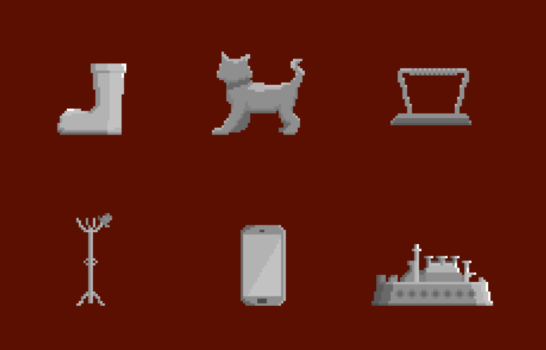

# Property Tycoon

### A Monopoly-inspired Desktop Game

## Features

- Player movement and turn-based gameplay
- Property ownership and selling
- Rent calculation and financial management
- Game state and turn logic
- Data-driven game configuration using CSV files

## About

**Property Tycoon** is a Monopoly-inspired desktop game developed as a five-person software engineering group project for the University of Sussex. Built using **Godot .NET and C#**, the project features player movement, property management, rent calculation, and turn-based gameplay.

*Player given the option between purchase or auction.*

## Team

- **Cal:** Project lead, developer
- **Ben:** Lead developer
- **Sam:** Documentation, assets
- **Aaron:** Documentation
- **Yash:** Documentation

## Technology

- **Language:** C#
- **Game Engine:** Godot .NET
- **Data:** CSV
- **Version Control:** Git
- **Development Methodology:** Agile

## Development Process

The project was developed collaboratively using Agile software engineering practices. The team participated in sprint planning, code reviews, feature development, testing, and integration throughout the project.

Git was used for version control and to manage the integration of individual contributions into the shared codebase.

## Running the Application

Download the latest release and extract the provided files. Run the `.exe` file to launch the application.

The executable requires the accompanying data files to remain within the provided directory structure.

## Post-Submission Updates

> **Repository Note:** The project was originally submitted in **April 2025**. This GitHub repository was updated in **September 2026**.
>
> Post-submission commits relate to documentation and presentation of the project. These updates do not modify the application submitted for assessment.

